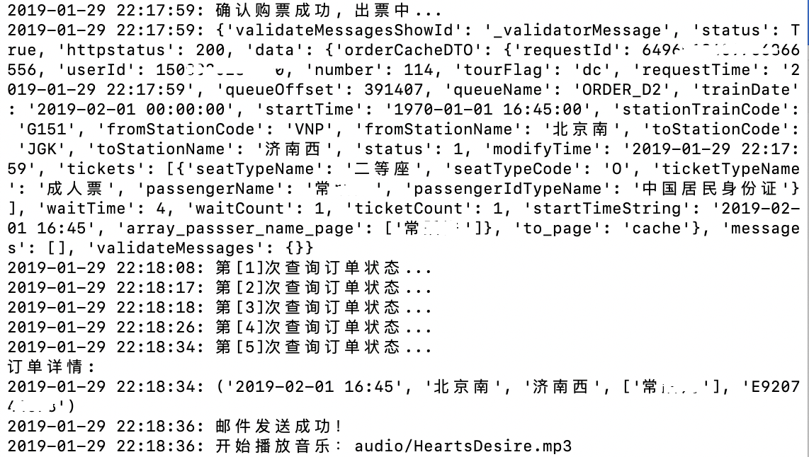
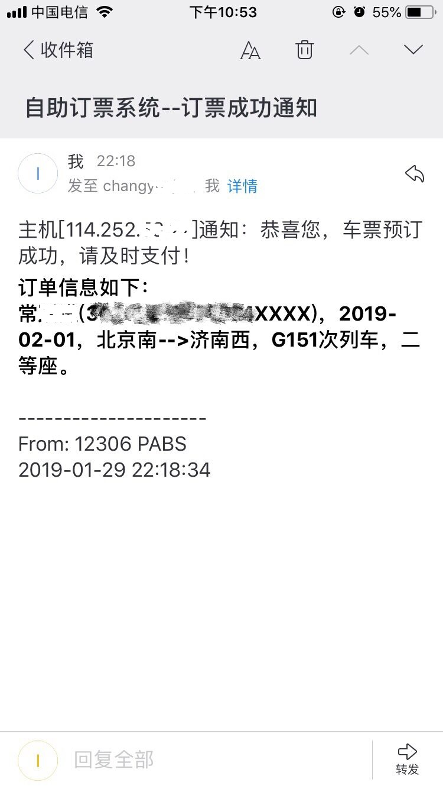

基于Python的12306自动订票系统
=============================
### 系统功能
```
1.余票监控：发现余票自动下单
2.自动打码：采用第三方免费接口/本地识别算法两种模式，自动验证图片验证码
3.小黑屋：发展有余票但是下单失败的车次，自动加入小黑屋
4.邮件通知：下单异常或下单成功后邮件通知用户，以便及时处理
5.全国CDN轮询：提高余票查询频率的同时尽量避免IP被封禁
6.远程日志：抢票日志推送到远程服务器，方便查询
7.动态任务：定时扫描任务变化，动态增减任务
8.并行任务：支持多个抢票任务同时进行
9.远程任务：支持从远程服务器下载任务
9.选座功能：支持选座，优先抢备选座位类型，如：F
10.候补抢票：开启候补功能后，系统支持候补抢票
11.全类型抢票支持：支持各种车票类型，如：成人票、儿童票、学生票、残军票
12.支持起售抢票：开启起售抢票模式后，系统在起售时间到到达后开启高频抢票模式
```
### 运行环境
Python3.6-3.7

### 运行截图
#### 运行日志

#### 邮件信息

#### 12306订单信息

#### 最近上车日志
```
[2019-12-23 12:30:31 client('111.xxx.xxx.194', 50415)]: 正在抢 2020-01-21：[xxx]次 北京--->XXX
[2019-12-23 12:30:31 client('111.xxx.xxx.194', 50415)]: 提交订单成功！
[2019-12-23 12:30:32 client('111.xxx.xxx.194', 50415)]: 票价:
[2019-12-23 12:30:32 client('111.xxx.xxx.194', 50415)]: 一等座(314.50元)有票 | 二等座(184.50元)有票 | 商务座(589.50元)3张票 | 
[2019-12-23 12:30:32 client('111.xxx.xxx.194', 50415)]: 检查订单信息成功!
[2019-12-23 12:30:34 client('111.xxx.xxx.194', 50415)]: 排队成功, 你排在: 第 0 位, 该坐席类型还有余票: XX 张
[2019-12-23 12:30:34 client('111.xxx.xxx.194', 50415)]: 确认购票成功, 出票中...
[2019-12-23 12:30:34 client('111.xxx.xxx.194', 50415)]: 第[1]次查询订单状态...
[2019-12-23 12:32:39 client('111.xxx.xxx.194', 50415)]: 第[2]次查询订单状态...
[2019-12-23 12:32:40 client('111.xxx.xxx.194', 50415)]: 恭喜您，抢票成功！
[2019-12-23 12:32:40 client('111.xxx.xxx.194', 50415)]: 开始播放音乐：audio/HeartsDesire.mp3
[2019-12-23 12:44:57 client('111.xxx.xxx.194', 52354)]: 扫描抢票任务开始...
[2019-12-23 12:44:57 client('111.xxx.xxx.194', 52354)]: 添加抢票任务-->20191223111003-2020-01-21-北京-XX
[2019-12-23 12:44:57 client('111.xxx.xxx.194', 52354)]: 当前购票账号：minxxxxxxx
[2019-12-23 12:44:59 client('111.xxx.xxx.194', 52354)]: [Thread-1] 2020-01-21 北京-XX 第[1]次查询成功!
[2019-12-23 12:44:59 client('111.xxx.xxx.194', 52354)]: 【xxx车次还有余票】: [2020-01-21] 出发时间:08:20 到达时间:14:32 历时:06:12 二等座:有票 
[2019-12-23 12:44:59 client('111.xxx.xxx.194', 52354)]: 恭喜您,uam验证成功!
[2019-12-23 12:44:59 client('111.xxx.xxx.194', 52354)]: 恭喜您,uamclient验证成功!
[2019-12-23 12:44:59 client('111.xxx.xxx.194', 52354)]: 正在抢 2020-01-21：[Gxxx]次 北京--->XX
[2019-12-23 12:45:02 client('111.xxx.xxx.194', 52354)]: [Thread-1] 2020-01-21 北京-XX 第[2]次查询成功!
[2019-12-23 12:45:02 client('111.xxx.xxx.194', 52354)]: 【xxx车次还有余票】: [2020-01-21] 出发时间:08:20 到达时间:14:32 历时:06:12 二等座:有票 
[2019-12-23 12:45:03 client('111.xxx.xxx.194', 52354)]: uam验证失败!用户已注销
[2019-12-23 12:45:03 client('111.xxx.xxx.194', 52354)]: 正在识别验证码...
[2019-12-23 12:45:04 client('111.xxx.xxx.194', 52354)]: 验证码校验成功!
[2019-12-23 12:45:05 client('111.xxx.xxx.194', 52354)]: 恭喜您, 登录成功!
[2019-12-23 12:45:05 client('111.xxx.xxx.194', 52354)]: 恭喜您,uam验证成功!
[2019-12-23 12:45:05 client('111.xxx.xxx.194', 52354)]: 正在抢 2020-01-21：[xxx]次 北京--->XX
[2019-12-23 12:45:06 client('111.xxx.xxx.194', 52354)]: 提交订单成功！
[2019-12-23 12:45:07 client('111.xxx.xxx.194', 52354)]: 票价:
[2019-12-23 12:45:07 client('111.xxx.xxx.194', 52354)]: 一等座(648.00元)无票 | 二等座(398.00元)有票 | 商务座(1215.50元)无票 | 
[2019-12-23 12:45:07 client('111.xxx.xxx.194', 52354)]: 检查订单信息成功!
[2019-12-23 12:45:09 client('111.xxx.xxx.194', 52354)]: 排队成功, 你排在: 第 0 位, 该坐席类型还有余票: XX 张
[2019-12-23 12:45:10 client('111.xxx.xxx.194', 52354)]: 确认购票成功, 出票中...
[2019-12-23 12:45:10 client('111.xxx.xxx.194', 52354)]: 第[1]次查询订单状态...
[2019-12-23 12:45:11 client('111.xxx.xxx.194', 52354)]: 第[2]次查询订单状态...
[2019-12-23 12:45:11 client('111.xxx.xxx.194', 52354)]: 恭喜您，抢票成功！
[2019-12-23 12:45:12 client('111.xxx.xxx.194', 52354)]: 开始播放音乐：audio/HeartsDesire.mp3
```

### 使用说明
#### 安装依赖
```
pip install -i https://pypi.tuna.tsinghua.edu.cn/simple -r requirements.txt
```
#### 文件说明
audio/.mp3--音频文件，用于通知，请自行[下载](http://www.itsmartkit.com/audio/audio.rar)<br>
config/booking.yaml--抢票任务配置文件<br>
config/conf.yaml--系统配置文件<br>
utils/sendEmail.py--邮件发送模块<br>
main.py--主程序<br>
server.py--邮件代发服务端程序<br>
client.py--邮件代发客户端程序(ps: 有些网络下邮件发送失败，需要代发)<br>
captcha/model.h5--文字识别数据文件<br>
captcha/12306.image.model.h5--图片识别数据文件，数据文件未上传至仓库，请自行[下载](http://www.itsmartkit.com/captcha/model.rar)<br>
#### 重点关注
运行文件：**server.py、main.py**<br>
重点配置：**conf.yaml、booking.yaml**<br>

### 致谢
程序参考了部分开源项目，对以下同仁表示感谢~<br>
下单程序参考 https://github.com/Henryhaohao/12306_Ticket.git 感谢 [Henryhaohao](https://github.com/Henryhaohao/12306_Ticket.git)<br> 
全国CDN获取参考 https://github.com/testerSunshine/12306.git 感谢 [文贤平](https://github.com/testerSunshine/12306.git)<br>
验证码识别算法参考 https://github.com/zhaipro/easy12306.git 感谢 [宅教授](https://github.com/zhaipro/easy12306.git)<br>

### 总结
订票信息配置正确便可运行，适合有一定编程基础的读者<br>
系统快速开发而成，并应用于2019/2020年春运抢票，请忽略代码质量问题~<br>
希望能帮你抢到一张心仪的票！<br>
欢迎 [提问](https://github.com/itsmartkit/12306-Ticket-Booking/issues) 或来信 itsmartkit@163.com<br>
